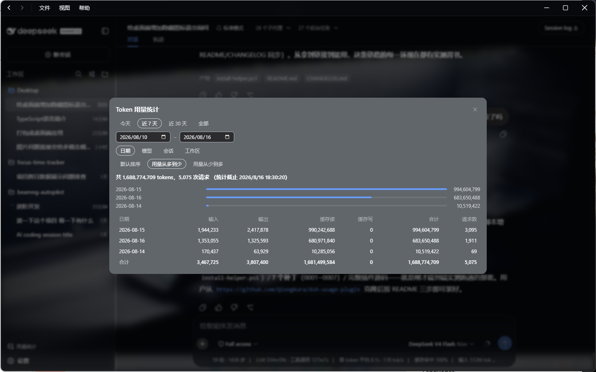
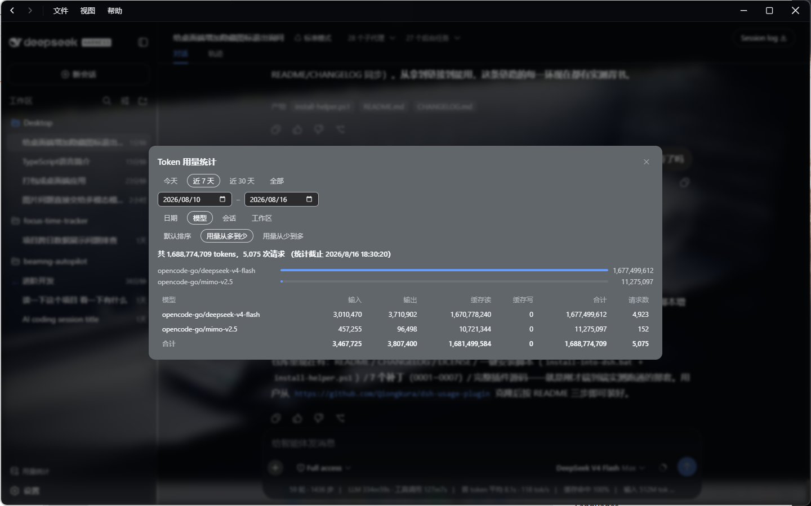
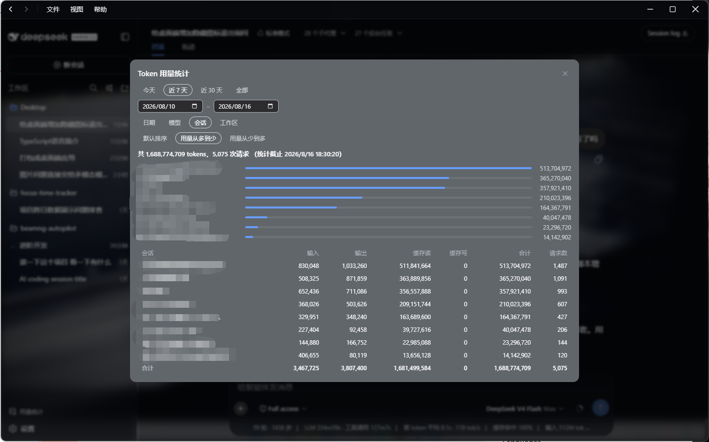

# dsh-usage-plugin

<div align="center">

**中文** | [English](README.en.md)

</div>

> [!CAUTION]
> **用量统计已知问题：宽时间范围下数据膨胀**
>
> 当查询时间范围超过「今天」时（如选"近 7 天"），后端折叠逻辑（`usage-query`）会为同一日期产生**重复样本**，导致 Token 总量虚高（实测偏差达 2.4 倍）。
> **临时规避**：面板选"今天"时数据准确；选其他范围时，显示的数字可能偏高，请以"今天"视图的数据为准确参考。
>
> 此问题的根因在 DSH `usage-query` 包的折叠/聚合链路（`scanRawUsageEvents` / `rootOf` / `aggregateSamples` 交互），需 DSH 维护者修复。修复前此警告持续有效。

DeepSeek Harness（DSH）的 **Token 用量统计** 插件：侧边栏底部入口 + 模态面板，查看所有会话的 Token 消耗。

它是 DSH 官方「用量统计」的**增强版**——在官方功能之上新增了**工作区分组**、**按 Token 排序**、**子代理用量合并**。

---

## 🚀 快速开始（三步）

> 前提：另一台电脑上有 **DSH 源码仓库**（不是只装了桌面应用）。

```bat
:: 第 1 步：下载本插件
git clone https://github.com/Qiongkura/dsh-usage-plugin
cd dsh-usage-plugin

:: 第 2 步：一键安装（把路径换成你的 DSH 仓库根目录）
install-into-dsh.bat D:\deepseek-harness

:: 第 3 步：启动 DSH，打开 http://127.0.0.1:3080
cd D:\deepseek-harness
pnpm run build:web    :: 首次需要构建 Web 界面（约 3 秒）
pnpm run start:web
```

打开网页后，**侧边栏底部**有一个 📊 图标，点开就是用量统计面板。

脚本会自动完成所有事情：**（必要时）给宿主打 usage 补丁** → 把插件放进 DSH → 把插件加入 dsh-web-app 依赖 → 禁用官方重复插件 → 注册 → `pnpm install` → 构建 host/client。重复运行脚本是安全的（幂等，已完成的步骤会自动跳过）。

> ✅ 完整流程已在干净的官方 master（`47f9438`）上实测通过：补丁应用 → 构建 → 启动 → `usage.query` 返回数据，全部成功。

---

## 🩹 关于 usage 补丁（重要背景）

`usage.query` RPC 端点是本插件的依赖。但官方 deepseek-harness 仓库**目前还没有**这个端点（usage 功能独立开发，尚未合入官方）。因此：

- 如果宿主**已有** `usage.query` 端点 → 脚本跳过补丁
- 如果宿主**没有** → 脚本自动应用 `patches/` 目录里的 **7 个补丁**（已在官方 master `47f9438` 上验证可干净应用）

7 个补丁各做什么：

| 补丁 | 内容 |
|---|---|
| `0001` | 新增 usage 域：宿主 `usage.query` RPC 端点、`dsh-usage-query` 聚合服务、`ui-usage` 面板与入口 |
| `0002` | 会话行显示中文标题、总计行、面板透明化 |
| `0003` | 日期输入框样式、未选中 chip 透明 / 选中描边 |
| `0004` | 修复 usage 面板测试的类型断言 |
| `0005` | 面板 overlay 层级提升（`z-index: 1000`） |
| `0006` | 工作区分组维度 + Token 排序 + 面板 overlay 改为 portal 渲染（修复代码块语言标签浮在面板上的问题） |
| `0007` | 补齐 `ui-usage` 的 `react-dom` / `@types/react-dom` 依赖（portal 渲染需要，否则 client 构建报 TS2307） |

> 如果你的 DSH 仓库比基线新很多，补丁可能无法应用——脚本会明确报错，不会破坏你的仓库。

---

## ❓ 常见问题

### 1. 脚本报错「补丁无法应用」？

说明你的 DSH 仓库与补丁基线（官方 master `47f9438`）偏离较大。先确认仓库状态：

```bat
git -C D:\deepseek-harness log --oneline -1
git -C D:\deepseek-harness status
```

如果仓库没有未提交改动，可以重置到基线再装：

```bat
git -C D:\deepseek-harness fetch origin
git -C D:\deepseek-harness reset --hard origin/master
```

再重新运行 `install-into-dsh.bat`。

### 2. 为什么要禁用官方的 usage-query / ui-usage？

本插件是官方功能的**替代品**，两者注册的是**同一个服务**（`ctx.usageQuery`）和**同一个入口**。同时启用会冲突（启动报错 `service "usageQuery" has been registered` 或出现两个入口）。脚本会自动给官方插件加 `disabled: true`，让本插件接管——**数据获取完全由本插件自己完成**，不会丢数据。

想恢复官方插件？把 `packages\bundle\web-app\cordis.patch.yml` 里 `usage-query` / `ui-usage` 条目的 `disabled: true` 删除即可。

### 3. 能 `pnpm add dsh-usage-plugin` 吗？

**暂时不行**。插件还没发布到 npm，而且依赖的 DSH 官方包在 npm 上也不完整。请用上面的 GitHub + workspace 方式安装。

### 4. 没有 DSH 源码仓库，只有桌面应用？

插件目前需要挂进 DSH 源码仓库使用；只装了桌面应用的环境暂不支持单独安装。

### 5. 启动报错「Cannot find package 'dsh-usage-plugin'」？

说明插件没有进入 dsh-web-app 的依赖树（profiles 无法解析）。重新运行 `install-into-dsh.bat`（脚本会自动添加依赖并重新 `pnpm install`）。

### 6. 如何升级插件？

```bat
cd dsh-usage-plugin
git pull
install-into-dsh.bat D:\deepseek-harness
```

脚本是幂等的：补丁已应用的会跳过、依赖已添加的会跳过、官方插件已禁用的会跳过。之后重建前端即可：

```bat
cd D:\deepseek-harness
pnpm run build:lib:client
pnpm run build:web
```

### 7. 如何卸载插件？

1. 编辑 `packages\bundle\web-app\package.json`，删除 `"dsh-usage-plugin": "workspace:*"` 依赖
2. 编辑 `packages\bundle\web-app\cordis.patch.yml`，删除注册条目 `- id: usage-plugin`，并把 `usage-query` / `ui-usage` 条目上的 `disabled: true` 删除（恢复官方插件）
3. 删除插件目录 `packages\usage\usage-plugin`
4. （可选）撤销 usage 补丁：`git -C D:\deepseek-harness checkout -- packages/host/apiproxy packages/usage packages/client/ui-usage`
5. 重新 `pnpm install` 并构建

---

## ✨ 功能特性

| 功能 | 说明 |
|---|---|
| **分组维度**（可多选） | **日期**（按天）、**模型**（按 provider/model）、**会话**（显示中文标题）、**工作区**（只显示目录名） |
| **排序方式** | 默认排序 / 用量从多到少 / 用量从少到多 |
| **时间范围** | 今天 / 近 7 天 / 近 30 天 / 全部 / 自定义起止日期 |
| **统计详情** | 条形图 + 汇总表（输入、输出、缓存读、缓存写、合计、请求数）+ 总计行 |
| **子代理合并** | 子代理（subagent）的用量自动归入发起它的根会话，不再单列一行 |
| **只读安全** | 从不创建/恢复代理、从不构造提示词、从不发起模型请求 |

### 面板操作

1. 点侧边栏底部 📊 **用量统计**
2. 选时间范围 → 勾分组维度 → 选排序方式
3. 看条形图和汇总表；点遮罩、× 或按 `Esc` 关闭

> 面板打开瞬间会冻结统计截止时刻，打开之后产生的用量下次打开才计入。

---

## 📸 界面展示

面板按分组维度展示，依次为 **日期 → 模型 → 会话 → 工作区**：

**① 按日期**


**② 按模型**


**③ 按会话**


**④ 按工作区**


---

## 🔧 手动安装（不用脚本时）

```bash
# 0. 先给宿主打 usage 补丁（如果宿主还没有 usage.query 端点）
#    检查：grep -r "usage.query" packages/host/apiproxy/src/fetch/handler.ts
#    没有则（在 DSH 仓库根目录执行，注意补丁顺序不能乱）：
cd D:/deepseek-harness
git apply --ignore-whitespace ../dsh-usage-plugin/patches/0001-feat-usage-daily-token-usage-panel-with-incremental-.patch
git apply --ignore-whitespace ../dsh-usage-plugin/patches/0002-usage-session-titles-in-rows-full-totals-row-transpa.patch
git apply --ignore-whitespace ../dsh-usage-plugin/patches/0003-usage-transparent-panel-and-date-inputs-keep-gray-bo.patch
git apply --ignore-whitespace ../dsh-usage-plugin/patches/0004-fix-usage-panel-test-types.patch
git apply --ignore-whitespace ../dsh-usage-plugin/patches/0005-usage-overlay-z-index.patch
git apply --ignore-whitespace ../dsh-usage-plugin/patches/0006-usage-workspace-sort-portal.patch
git apply --ignore-whitespace ../dsh-usage-plugin/patches/0007-ui-usage-react-dom-deps.patch

# 1. 把插件 clone 进 DSH 仓库
git clone https://github.com/Qiongkura/dsh-usage-plugin.git \
  D:/deepseek-harness/packages/usage/usage-plugin

# 2. 把插件加入 dsh-web-app 依赖（关键！否则启动报
#    "Cannot find package 'dsh-usage-plugin'"）
#    编辑 packages/bundle/web-app/package.json 的 dependencies，添加：
#    "dsh-usage-plugin": "workspace:*"

# 3. 禁用官方插件：编辑 packages/bundle/web-app/cordis.patch.yml
#    找到这两段，在原条目上加 disabled: true：
#    - id: usage-query
#      name: '@deepseek-ai/dsh-usage-query'
#      disabled: true
#    - id: ui-usage
#      name: '@deepseek-ai/dsh-client-ui-usage'
#      disabled: true

# 4. 在同一个文件里注册本插件：
#    - id: usage-plugin
#      name: 'dsh-usage-plugin'

# 5. 安装并构建
cd D:/deepseek-harness
pnpm install
pnpm run build:lib:host
pnpm run build:lib:client
pnpm run build:web

# 6. 启动
pnpm run start:web
```

---

## 🏗️ 架构

```
┌─────────────────────┐       ┌──────────────────────────────┐
│  Browser (web GUI)  │       │  Host (node)                 │
│  src/client/        │  RPC  │  src/index.ts                │
│  UsageTrigger       │──────▶│  UsageQuery (cordis service) │
│  UsagePanel         │       │  ├─ sessionQuery 读会话元数据 │
│  usage-api (types)  │       │  ├─ sessionPersistence 读日志│
└─────────────────────┘       │  └─ 折叠 usage 事件 → 聚合行  │
                              └──────────────────────────────┘
```

- **`src/client/`** —— 浏览器端：侧边栏入口 + 用量面板。数据通过一次 `usage.query` RPC 获取。
- **`src/index.ts`** —— 宿主端 Cordis 服务：跨会话 Token 用量聚合（`ctx.usageQuery`）。
- **`src/server/`** —— 聚合纯函数（fold / raw / types）与 zod 契约 schema。

> `usage.query` RPC 端点由 DSH 宿主（dsh-host-apiproxy）提供；本插件只提供背后的聚合服务与前端面板。

## 环境要求

| 依赖 | 版本 | 说明 |
|---|---|---|
| DeepSeek Harness 源码仓库 | 官方 master `47f9438` 或更新 | 宿主运行时；若不含 usage 域，安装脚本会自动打补丁 |
| Node.js | 20+ | |
| pnpm | 9+ | 构建 |

---

## 🛠️ 开发

```bash
pnpm install
pnpm build      # tsc + tsdown 构建（lib/index.js + lib/client.js）
pnpm typecheck  # 仅类型检查
pnpm test       # 运行测试
```

### 目录结构

```
src/
├── index.ts              # 宿主端：UsageQuery 服务（cordis Service）
├── server/
│   ├── types.ts          # 查询/行/结果类型
│   ├── fold.ts           # 纯折叠：提取样本、分组、排序、校验
│   ├── raw.ts            # 原始日志行扫描（usage 事件 + 会话标题）
│   └── usage.schema.ts   # zod 契约（请求/响应校验）
└── client/
    ├── index.ts          # 浏览器端插件入口（注册字典 + 底部入口）
    ├── UsageTrigger.tsx  # 侧边栏底部触发器
    ├── UsagePanel.tsx    # 用量模态面板
    ├── usage-api.ts      # 浏览器端 usage 域类型（本地）
    ├── locales.ts        # zh/en 文案
    └── *.module.css      # 样式（CSS Modules）
```

---

## 📜 与官方 ui-usage 的关系

本插件源自 DeepSeek Harness 官方 `@deepseek-ai/dsh-client-ui-usage` / `@deepseek-ai/dsh-usage-query`，独立化后新增：

- 工作区分组维度（`workspace`）
- 按 Token 用量排序（`sortBy: tokens-desc / tokens-asc`）
- 子代理用量合并到根会话
- 工作区显示名简化（只显示目录名）

## License

[MIT](LICENSE)
